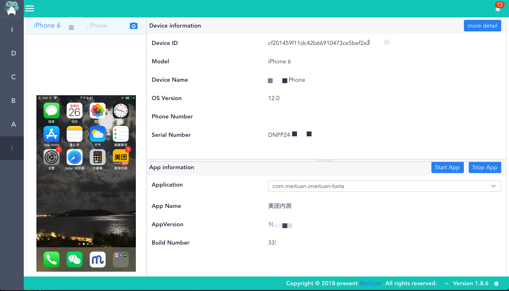

# Lyrebird iOS Plugin
[](https://travis-ci.org/Meituan-Dianping/lyrebird-ios)
[](https://pypi.python.org/pypi/lyrebird-ios)


---
Lyrebird 是一个基于拦截以及模拟 HTTP/HTTPs 网络请求的面向移动应用的插件化测试平台。iOS Plugin 是其插件之一，您可以在插件中快速查看已连接设备的详细设备信息，截取屏幕快照，以及查看已连接设备的应用信息。

## 特性
* 支持快速截取 iOS 设备屏幕快照
* 在主页您可以快速查看已连接设备的详细信息
* 在应用管理页面可以快速查看已连接设备的应用信息

## 环境要求
- macOS
- [Python >= 3.6](https://www.python.org/downloads/release/python-360/)
- [libimobiledevice](https://github.com/libimobiledevice/libimobiledevice)
- [Command Line Tools for Xcode](https://developer.apple.com/download/more/)

## 准备
插件依赖于 libimobiledevice 第三方依赖

- 首先，安装源管理工具 [Homebrew](https://brew.sh/)

- 现在，通过 Homebrew 开始安装 [libimobiledevice](https://github.com/libimobiledevice)

    ```bash
    brew install --HEAD libimobiledevice
    brew link --overwrite libimobiledevice
    sudo chmod -R 777 /var/db/lockdown/
    ```

- 最终，测试第三方依赖是否正常工作

    ```bash
    ideviceinfo
    idevicescreenshot
    ```

## 安装

- 安装 Lyrebird plugin - iOS

```bash
pip3 install lyrebird-ios
```


## 启动

```bash
lyrebird
```

## 预览



## 开发者

1. clone本项目

    ```
    git clone <repo>
    ```

2. 进入项目目录

    ```
    cd lyrebird-ios
    ```

3. 创建虚拟环境

    ```
    python3 -m venv venv
    ```
    
4. 使用IDE打开工程（推荐Pycharm或vscode）

## 常见问题
#### libimobiledevice 无法使用，终端提示 - "Could not connect to lockdownd ...".
重新安装 libimobiledevice, 安装完成后执行以下命令

`sudo chmod -R 777 /var/db/lockdown/`

> Tips:
> 
> 参考解决方案自 [stackoverflow](http://stackoverflow.com/questions/39035415/ideviceinstaller-fails-with-could-not-connect-to-lockdownd-exiting)

#### 截取屏幕快照功能无法正常工作，提示 Could not start screenshot service!
在连接设备之前您必须确保开发者选项可用。通过 [stackoverflow](https://stackoverflow.com/questions/30736932/xcode-error-could-not-find-developer-disk-image) 获取更多解决帮助。
