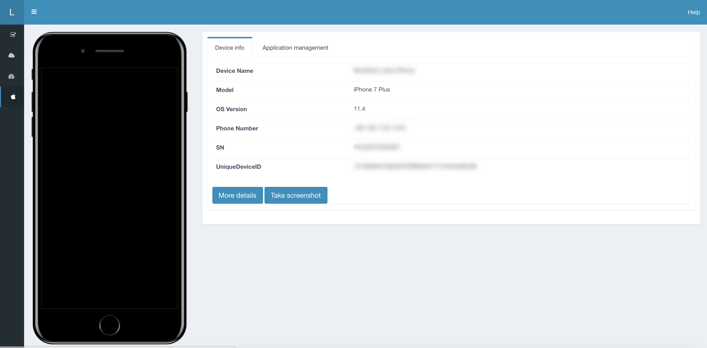

# Lyrebird plugin iOS

The easiest way to manage your iOS devices.

## Feature
* Support for take screenshot.
* Device details are displayed on the Home page.
* App info is displayed on the Application Management page.
* Integration in overbridge.
* Support for adding screenshot attachments to Bugit.

## Required
- macOS
- [Python >= 3.6](https://www.python.org/downloads/release/python-360/)
- [libimobiledevice](https://github.com/libimobiledevice/libimobiledevice)
- [ideviceinstaller](https://github.com/libimobiledevice/ideviceinstaller)
- [Command Line Tools for Xocde](https://developer.apple.com/download/more/)

## Get ready
This plugin currently depends on libimobiledevice to do certain things. Install it with Homebrew.

- First, install [Homebrew](https://brew.sh/).

- Now, you can install [libimobiledevice](https://github.com/libimobiledevice) like this

    ```bash
    $ brew install --HEAD libimobiledevice
    $ brew link --overwrite libimobiledevice
    $ brew install --HEAD ideviceinstaller
    $ brew link --overwrite ideviceinstaller
    $ sudo chmod -R 777 /var/db/lockdown/
    ```

- Now, you can plugged in your iOS device and testing your libimobiledevice commandline tools.

    ```bash
    $ ideviceinfo
    $ idevicescreenshot
    ```
   
## Get started
- Install Lyrebird plugin - iOS

```
$ pip3 install lyrebird-ios
```

    
## Preview


## For developer
1. Clone repo

    ```
    $ git clone <repo>
    ```
2. Enter to lyrebird-ios

    ```
    $ cd lyrebird-ios
    ```
3. Make virtual environment

    ```
    $ python3 -m venv venv
    ```
    
4. Open project

## FAQs
#### Some error occurs like this - "Could not connect to lockdownd ...".
Re-install both libimobiledevice and ideviceinstaller, and then make sure below command executed

`$ sudo chmod -R 777 /var/db/lockdown/`

> Tips:
> 
> Reference solution on [stackoverflow](http://stackoverflow.com/questions/39035415/ideviceinstaller-fails-with-could-not-connect-to-lockdownd-exiting)

#### Could not use screenshot feature, Could not start screenshotr service!
You must have to mount the developer disk image on your device. See -> [How to enable dev on your device](https://www.jianshu.com/p/a1d075b3472c)
